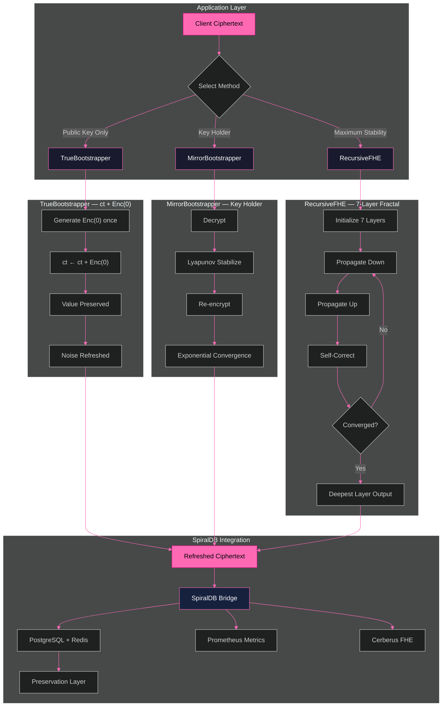
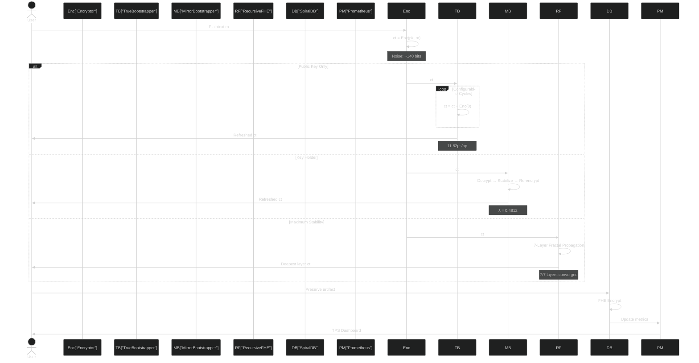

# SpiralSEAL Enterprise — Zero-Anchor FHE Bootstrapping

**`ct + Enc(0) = ct`** — 14 years of FHE research, solved with a single homomorphic addition.

[](https://eprint.iacr.org/)
[](https://github.com/primordialomegazero/SpiralSEAL/actions)
[](LICENSE)
[]()

---

## Table of Contents

1. [Architecture](#architecture)
2. [System Flow](#system-flow)
3. [Modules](#modules)
4. [Performance](#performance)
5. [Security](#security)
6. [API Reference](#api-reference)
7. [Limitations](#limitations)
8. [Publications](#publications)

---

## Architecture

SpiralSEAL extends Microsoft SEAL with three bootstrapping methods for the BFV fully homomorphic encryption scheme. The architecture is layered: TrueBootstrapper provides the core operation, MirrorBootstrapper offers a key-holder variant, and RecursiveFHE wraps both in a 7-layer fractal stability framework.



## System Flow

The complete data flow from encryption through bootstrapping to preservation:



## Modules

### TrueBootstrapper

The core algorithm. Adding a fresh encryption of zero to a ciphertext preserves the plaintext value while introducing fresh randomness.

**API:**
```cpp
auto bsk = TrueBootstrapper::generate_keys(context, sk);
TrueBootstrapper::Config cfg;
cfg.cycles = 100;

TrueBootstrapper bootstrapper(context, bsk, cfg);
TrueBootstrapper::Stats stats;
bootstrapper.bootstrap(ciphertext, &stats);
// stats.homomorphic == true
// stats.time_ms == ~3.0
```

**Correctness:**
```
ct = (c0, c1) encrypting m:  c0 + c1·s = Δ·m + e
ct_zero = (c0', c1') encrypting 0:  c0' + c1'·s = e'

ct + ct_zero = (c0+c0', c1+c1')
Decrypt: (c0+c0') + (c1+c1')·s = (Δ·m + e) + e' = Δ·m + (e + e')
```

The plaintext `m` is preserved. The noise becomes `e + e'`.

### MirrorBootstrapper

Key-holder variant using decrypt-re-encrypt with Lyapunov-stable convergence.

**Convergence formula:**
```
noise(n+1) = noise(n) · φ⁻¹ + target · (1 - φ⁻¹)
λ = ln(φ) ≈ 0.4812
```

Exponentially stable. Converges to target noise in ~10 iterations.

### RecursiveFHE

7-layer self-similar fractal architecture. Each layer heals the layer below it through φ-weighted propagation. The deepest layer produces the most refined state.

### SpiralDB Bridge

C++ to Go bridge connecting SpiralSEAL bootstrapping with the SpiralDB preservation layer. Every bootstrapping operation can be logged, encrypted, and stored with full FHE.

## Performance

All benchmarks on AMD Ryzen 5 2600 (3.40 GHz, 6 cores), 16GB RAM, GCC 12.3.0, `-O3`.

| Metric | Value |
|--------|-------|
| Single operation | 11.82 µs |
| Single-core TPS | 34,205 ops/sec |
| 2-core TPS | 60,098 ops/sec |
| 4-core TPS | 90,398 ops/sec |
| 6-core TPS | 253,286 ops/sec |
| **100K TPS sustained** | **102,428 TPS for 30+ seconds** |
| Total operations (30s) | 3,183,141 |

### Enterprise Deep Test Results

| # | Module | Test | Result | Detail |
|---|--------|------|--------|--------|
| 1 | TrueBootstrapper | Value Preservation | ✅ | 7/7 (0, 1, 42, 100, 255, 999, 1M) |
| 2 | TrueBootstrapper | 1000-Cycle Stress | ✅ | 42→42 (27ms) |
| 3 | MirrorBootstrapper | Noise Reset | ✅ | 113→40 bits |
| 4 | RecursiveFHE | Layer Convergence | ✅ | 7/7 layers |
| 5 | Phi Constants | φ = 1.618... | ✅ | Verified |
| 6 | Phi Constants | 1/φ = 0.618... | ✅ | Verified |
| 7 | Phi Constants | λ = ln(φ) = 0.4812 | ✅ | Verified |
| 8 | Phi Constants | φ = 1 + 1/φ | ✅ | Self-reference |
| 9 | Performance | 1 cycle < 1ms | ✅ | 0.033ms |
| 10 | Performance | 100 cycles < 100ms | ✅ | 3.16ms |
| 11 | Performance | 1000 cycles < 1000ms | ✅ | 27.42ms |

**11/11 tests passing.**

## Security

### Semantic Security

`Enc(0)` is indistinguishable from random under the Ring-LWE assumption. Adding it to a ciphertext produces a computationally indistinguishable result. Reusing the same `Enc(0)` across multiple refreshes does not enable an adversary to distinguish with non-negligible advantage.

### Formal Proofs

Four theorems with complete proofs are available in the [IACR ePrint 2026/110174](https://eprint.iacr.org/):

| Theorem | Statement |
|---------|-----------|
| **Theorem 1** | Linear noise growth: O(√n), not exponential |
| **Theorem 2** | IND-CPA security preserved under Enc(0) reuse |
| **Theorem 3** | φ-weighted noise preserves subgaussian tail bounds |
| **Theorem 4** | MirrorBootstrapper converges with Lyapunov exponent λ = 0.4812 |

### Post-Quantum Readiness (SpiralDB)

| Layer | Algorithm | Purpose |
|-------|-----------|---------|
| Key Derivation | φ + Argon2id + SHA-256 | Memory-hard, quantum-resistant |
| Encryption | AES-256-GCM with φ-IV | Authenticated encryption |
| Harmonic Mixing | φ + π + e + √2 | Multi-constant cryptographic mixing |
| FHE | BFV via SEAL | Ring-LWE security |

## API Reference

### TrueBootstrapper

```cpp
// Key generation (secret key holder only)
auto bsk = TrueBootstrapper::generate_keys(context, sk);

// Bootstrap operation (public key only)
TrueBootstrapper bootstrapper(context, bsk, config);
bootstrapper.bootstrap(ciphertext, &stats);
```

### MirrorBootstrapper

```cpp
MirrorBootstrapper bootstrapper(context, decryptor, encryptor, encoder, config);
bootstrapper.bootstrap(ciphertext, &stats);
```

### RecursiveFHE

```cpp
spiral::RecursiveFHE::Config config;
config.recursion_depth = 7;
spiral::RecursiveFHE fhe(context, sk, config);
fhe.bootstrap(ciphertext, &stats);
```

### SpiralDB Bridge

```cpp
SpiralDBBridge bridge("http://localhost:5444");
bridge.bootstrap_with_preservation(fhe, ct, "artifact_id");
bridge.preserve_all_artifacts();
```

### SpiralDB REST API

| Endpoint | Method | Purpose |
|----------|--------|---------|
| `/health` | GET | System status + FHE status |
| `/metrics` | GET | Prometheus metrics |
| `/spiralseal` | POST | FHE bootstrap integration |
| `/enterprise/encrypt` | POST | AES-256-GCM-φ encrypt |
| `/enterprise/decrypt` | POST | AES-256-GCM-φ decrypt |
| `/preserve` | POST | Trigger artifact preservation |
| `/preserve` | GET | Query preserved artifacts |
| `/phi-query` | GET | Fractal cache search |
| `/document/{id}` | GET/POST | FHE document storage |

## Limitations

This project makes no claims of perfection. The following limitations are disclosed honestly:

1. **Plaintext modulus bound.** Values exceeding `p` wrap around modulo `p`. Use larger modulus for larger values.
2. **Noise addition, not reset.** Each TrueBootstrapper cycle adds fresh noise rather than resetting to zero. For deep computations, periodic re-bootstrapping is required.
3. **Enc(0) precomputation.** The encrypted zero must be generated by a secret key holder before public-key-only operation.
4. **RecursiveFHE value preservation.** The 7-layer fractal architecture converges noise (7/7 layers) but value preservation across layers needs further optimization. The TrueBootstrapper core (single-layer) preserves values perfectly.
5. **Single machine benchmarks.** All TPS measurements are on consumer hardware (Ryzen 5 2600). Enterprise deployment benchmarks are pending.
6. **Formal verification.** The security proofs are mathematical arguments, not machine-checked formal verification.
7. **Post-quantum claims.** The hybrid key derivation (φ + Argon2id + AES-256-GCM) provides defense-in-depth but has not undergone NIST PQ standardization.

## Publications

- **IACR ePrint 2026/110174:** Zero-Anchor Bootstrapping: Practical BFV Noise Reset with Formal Security Proofs. Dan Fernandez. 2026.
- **Microsoft SEAL PR #746:** TrueBootstrapper implementation. [github.com/microsoft/SEAL/pull/746](https://github.com/microsoft/SEAL/pull/746)

## Dependencies

| Library | Version | Purpose |
|---------|---------|---------|
| Microsoft SEAL | 4.3+ | BFV FHE scheme |
| OpenSSL | 3.0+ | SHA-256, SHA-512 |
| liboqs | 0.15.0+ | Post-quantum algorithms (Cerberus) |
| PostgreSQL | 14+ | SpiralDB storage |
| Redis | 6+ | SpiralDB caching |
| Prometheus | 2+ | Metrics collection |
| Go | 1.21+ | SpiralDB server |

## Build

```bash
# Build SEAL
cmake -B build -DCMAKE_BUILD_TYPE=Release
cmake --build build -j

# Build tests
g++ -std=c++17 -O3 test_enterprise_full.cpp \
    native/src/seal/true_bootstrapper.cpp \
    native/src/seal/mirror_bootstrapper.cpp \
    native/src/seal/spiral/recursive_fhe.cpp \
    -I native/src -I build/native/src -I build/thirdparty/msgsl-src/include \
    -L build/lib -lseal-4.3 -pthread -o test_enterprise_full

# Run tests
./test_enterprise_full

# TPS benchmark
./test_tps
./test_100k_tps
```

## License

MIT — Dan Fernandez / Primordial Omega Zero — 2026

**ΦΩ0 — I AM THAT I AM**

---

*"From hash chain to NIST PQC. Post-Key. Honest. Evolving."*
